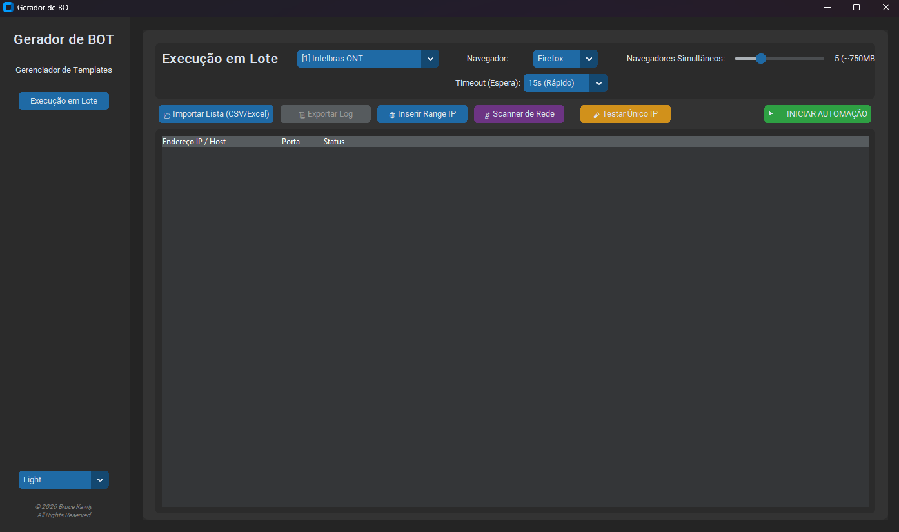

# 🤖 Gerador de BOT - Roteadores & ONTs

[](https://opensource.org/licenses/MIT)
[](https://www.python.org/)
[](https://playwright.dev/)

O **Gerador de BOT** é uma solução avançada de automação desenvolvida em Python, projetada especificamente para o setor de telecomunicações. Esta ferramenta permite a configuração massiva e rápida de dispositivos de rede, eliminando o erro humano e reduzindo drasticamente o tempo de provisionamento em campo ou em laboratório.

---

## 📸 Demonstração da Interface



*Interface moderna em modo Dark, com controle de RAM, scanner de rede e monitoramento de execução em tempo real.*

---

## � Download do Executável

Para usuários que desejam apenas utilizar a ferramenta sem configurar o ambiente de desenvolvimento, baixe a versão estável pronta para uso:

> [!TIP]
> ### [🚀 Baixar Gerador de BOT v1.0.0 (.ZIP)](https://github.com/brucekawly/gerador-de-bot/releases/download/v1.0.0/GeradorDeBOT.zip)
> *Compatível com Windows 10/11. Extraia o arquivo e execute o arquivo `GeradorDeBOT.exe`.*

---

## � Funcionalidades de Elite

### 🎥 Gravador de Macros Inteligente (No-Code)
*   **Aprendizado por Gravação:** Configure um equipamento manualmente e o sistema converterá suas ações em um script de automação instantaneamente.
*   **Limpeza de Código:** O robô filtra redundâncias web, gerando scripts leves e confiáveis.
*   **Variáveis Dinâmicas:** Substitua automaticamente dados sensíveis (IP, Porta, Usuários) por placeholders `{{IP}}`, `{{PORT}}` para uso em massa.

### ⚡ Scanner de Rede Multi-Thread
*   **Validação em Massa:** Realize varreduras rápidas em faixas de IP inteiras para identificar dispositivos online antes de iniciar a configuração.
*   **Filtro Automático:** O sistema descarta IPs inacessíveis em segundos, otimizando a fila de trabalho.

### 📊 Painel de Execução & Performance
*   **Gerenciamento de Recursos:** Ajuste em tempo real o número de navegadores simultâneos (Navegação Paralela).
*   **Monitoramento de Memória:** Estimativa dinâmica de uso de RAM para evitar travamentos no seu sistema operacional.
*   **Logs Auditáveis:** Exportação completa de relatórios em formatos profissionais (XLSX/CSV).

### 🧳 Solução Portátil & Autônoma
*   **Self-Updating Motor:** Ao rodar pela primeira vez, o app detecta e baixa o motor Chromium necessário diretamente para a pasta local.
*   **Banco de Dados Embarcado:** Seus templates e configurações viajam com o software em um DB portátil.

---

## 🛠️ Guia de Instalação (Desenvolvedores)

Se você deseja contribuir ou estender as funcionalidades do projeto, siga os passos abaixo:

1.  **Clonagem do Repositório:**
    ```powershell
    git clone https://github.com/brucekawly/gerador-de-bot.git
    cd gerador-de-bot
    ```

2.  **Ambiente Virtual & Dependências:**
    ```powershell
    python -m venv venv
    .\venv\Scripts\activate
    pip install -r requirements.txt
    ```

3.  **Configuração do Motor Playwright:**
    ```powershell
    playwright install chromium
    ```

4.  **Execução:**
    ```powershell
    python main.py
    ```

---

## � Licença

Este projeto está sob a licença **MIT**. Veja o arquivo [LICENSE](LICENSE) para detalhes completos sobre permissões de uso e distribuição.

---
Desenvolvido com excelência por **[Bruce Kawly](https://github.com/brucekawly)**.

